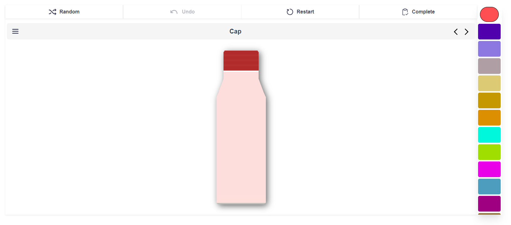

# Bottle Customizer

 
  
Table of Contents

  1. [Description](#description)
  1. [Technologies](#technlogies)
  1. [Resources](#resources)
  1. [Dependencies](#dependencies)
  1. [Installation](#installation)
  1. [Try It!](#try-it)
  1. [License](#license)
  1. [Contact Me](#contact-me)

## Description
This is an application that allows you to customize your water bottle.

The interface of the editor is very simple, at the top there is the toggle bar with all needed tools to ultimate the customization `[Randomize | Undo | Restart | Complete]`, while at the side there is the color bar, that can be used to choose the color of each part of the bottle.

The user can switch between each bottle part throught dropdown or directional buttons.

## Technologies
  
  

## Resources
* [Bottle Item](https://codepen.io/yoyo/pen/oyqEMx)

## Dependencies
* [Lodash](https://lodash.com/)
* [Iconify](https://iconify.design/)
* [Coreui](https://coreui.io/vue/docs/3.2/introduction/)
* [Pinia](https://pinia.vuejs.org/)
* [vue-router](https://router.vuejs.org/)
* [html-to-image](https://github.com/bubkoo/html-to-image)

## Installation
First of all, you need Node.js installed, you can download it [here](https://nodejs.org/it/download/).

1. Clone the repository: `git clone https://github.com/cavaliernicola/Bottle-Customizer.git`
1. Install the dependencies: `npm install`
1. Build the app: `npm run build`

## Try It!
You can try this app [HERE](https://genuine-youtiao-07227e.netlify.app)!

## License
Distributed under the MIT License. See [`LICENSE`](LICENSE) for more information.

## Contact Me
* Author: Nicola Cavalier 
* Email: cavaliernicola@gmail.com
